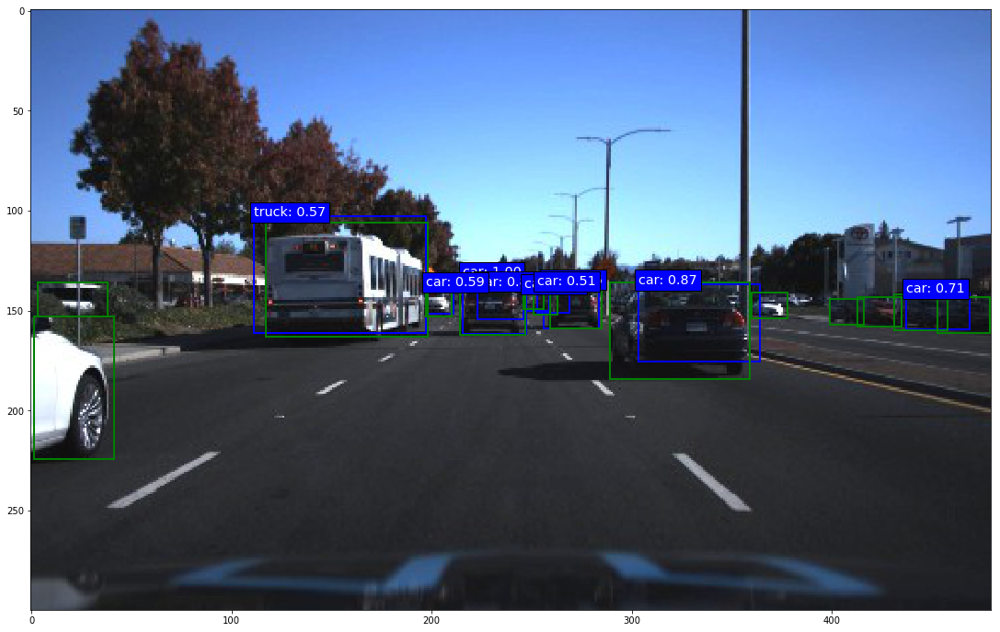
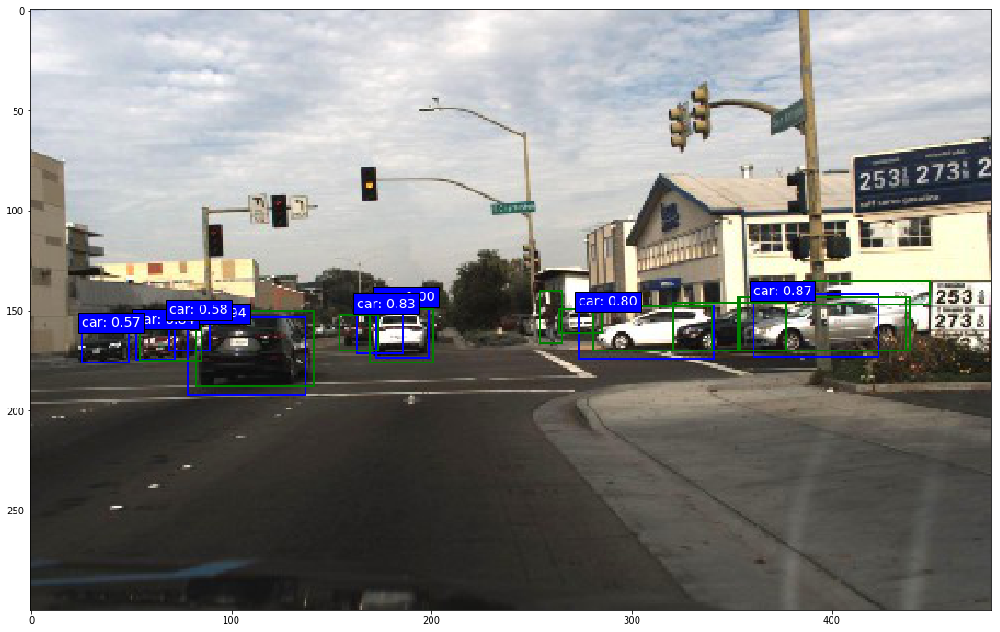

## SSD: Single-Shot MultiBox Detector ssd7 Enhancement in Keras
---

### Overview
The code for this project was created by Pierluigi Ferrari in his Github repository [ssd_keras](https://github.com/pierluigiferrari/ssd_keras). The project was copied to the book repository and adapted for this project.

Note that for this project we are going to build a smaller SSD network called SSD7. SSD7 is a small 7-layer version of SSD300 network. It is important to note that while SSD7 network would yield some acceptable results, SSD7 is not an optimized network architecture. 

This is a Keras port of the SSD model architecture introduced by Wei Liu et al. in the paper [SSD: Single Shot MultiBox Detector](https://arxiv.org/abs/1512.02325).

### Dependencies

* Python 3.x
* Numpy
* TensorFlow 1.x
* Keras 2.x
* OpenCV
* Beautiful Soup 4.x

The Theano and CNTK backends are currently not supported.

Python 2 compatibility: This implementation seems to work with Python 2.7, but I don't provide any support for it.

### Download the data

In this project we are going to use a toy dataset that was created by Udacity. You can visit Udacity’s [Github repository](https://github.com/udacity/self-driving-car/tree/master/annotations) for more information on the dataset. It has more than 22,000 labeled images and 5 object classes: car, truck, pedestrian, bicyclist, and traffic light. All images have been resized to a height of 300 pixels and a width of 480 pixels. You can download the dataset from [here](https://manning.box.com/s/rm9b4ksyiqlw6wu66vahmonubd8ixgq4).

What makes this dataset very interesting is that these are real-time images taken while driving in Mountain View California and neighboring cities during daylight conditions. No image cleanup was done. Take a look at the image examples below.

| | |
|---|---|
|  |  |
|  |  |

### Project steps:
After downloading the dataset and upload it intoo MyDrive
1- clone this repo to be included in your google drive as backend.
2- Use the frontend files to implement the project stages

Note: you can run Each stage independly.

### More tutorials

The repository currently provides only the SSD7 network architecture:
* SSD7: [`keras_ssd7.py`](models/keras_ssd7.py) - a smaller 7-layer version that can be trained from scratch relatively quickly even on a mid-tier GPU, yet is capable enough for less complex object detection tasks and testing. You're obviously not going to get state-of-the-art results with that one, but it's fast.

If you want more tutorials for SSD300 and SSD512, I encourage you to visit Pierluigi Ferrari's Github repository [ssd_keras](https://github.com/pierluigiferrari/ssd_keras).
